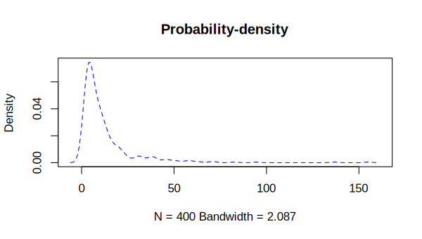
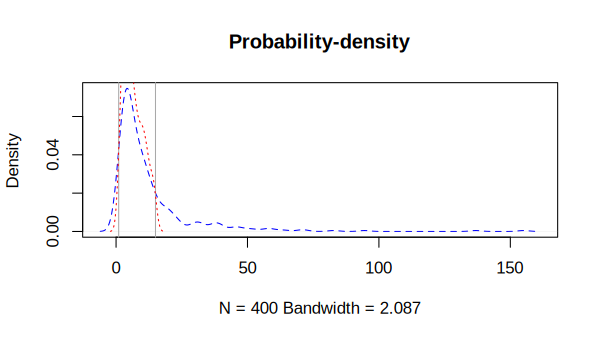
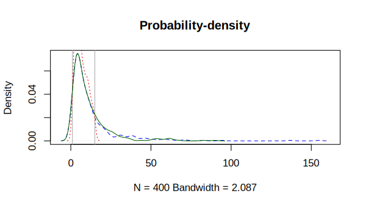

# `lnormimp` R package 

This is an R implementation of the algorithm for univariate imputation of censored lognormal distributions described in [Herbers et al. (2021)](https://doi.org/10.1016/j.cpnec.2021.100052).

This package is very light and depends on the packages `fitdistrplus` for fitting censored lognormal distributions and `EnvStats` to perform random draws from an interval of a lognormal distribution.

The entire source code can be found in [this file](https://github.com/nx10/lnormimp-r/blob/master/R/lnormimp.R).

## Installation

As this package is very small so we decided to keep it on GitHub and not submit it to CRAN.

It can be installed directly with the `remotes` package:

```R
install.packages("remotes") # In case it is not already installed
remotes::install_github("nx10/lnormimp-r")
```

## Example usage

Let's start by including the library and setting a fixed seed so the results can be replicated:

```R
library(lnormimp)
set.seed(1234)
```

Now we will create our test dataset by drawing some values from a lognormal distribution:

```R
data <- rlnorm(400, meanlog = 2, sdlog = 1)
```

Let's visualize our distribution with a probability density curve

```R
plot(density(data), col = "blue", lty = "dashed", main = "Probability-density")
```



Now to censor the data we define lower and upper cutoffs 

```R
lower_cutoff <- 1
upper_cutoff <- 15
```

Which will be visualized by drawing vertical lines on our density curve

```R
abline(v = lower_cutoff, col = "darkgray")
abline(v = upper_cutoff, col = "darkgray")
```


Then the cutoff values will be used to create a censored version our original dataset with a known number of missing values below the lower and above the upper cutoff:

```R
below_lower <- data < lower_cutoff
above_upper <- data > upper_cutoff

n_below <- sum(below_lower)
n_above <- sum(above_upper)

data_censored <- data[!(below_lower | above_upper)]
```

Let's have a quick look at how much data got censored:

```R
data.frame(n = length(data),
           n_below = n_below,
           n_above = n_above,
           n_censored = length(data_censored))
```

```
    n n_below n_above n_censored
1 400      10      88        302
```

From our original 400 values 98 got censored.

Now we can visualize the censored distribution:

```R
lines(density(data_censored), col = "red", lty = "dotted")
```



The censored distribution (dotted red) looks quite a bit different than the original distribution (dashed blue).

Now we reconstruct the original data from the censored by imputation:

```R
data_imputed <- lnormimp(
  data_censored,
  censn = c(n_below, n_above),
  cutoff = c(lower_cutoff, upper_cutoff)
)
```

_Note that if a plausable measurement range is known for real data, it can be specified with the optional `range` parameter to obtain even more realistic results. The measurement range is set by default to 0-Infinity._

Let's visualize the results one last time:

```R
lines(density(data_imputed), col = "darkgreen")
```



Visually inspecting the data, the imputed distribution (straight green) resembles the original data (dashed blue) much closer than the censored distribution (dotted red).

The [paper](https://doi.org/10.1016/j.cpnec.2021.100052) compares biases of different properties of the distributions (mean, median, standard deviation) and the methods robustnes. Let's replicate one of the papers calculations and calculate the Kolmogorov-Smirnov distance of the censored and imputed distribution in respect to the original data.

```R
> ks.test(data, data_censored)$statistic
   D 
0.22 

> ks.test(data, data_imputed)$statistic
    D 
0.045 
```

The full source code of this example can be found [here](https://github.com/nx10/lnormimp-r/blob/master/docs/example-usage.R).